# gitops-self-service-cloudflare
OpenTofu TF and Crossplane Self-Service TUI CLI driven (using Rust ratatui) workflows for Cloudflare Resources (CF CDN, CF Secret Store, Vault, CF D1 Postgres Storage, CF R2 for application and OpenTofu TF state storage, CF Workers, CF Containers. The project provides self-service architectures across three environments for three different clients at certain levels of automated IaC provisioning stages.

- Non-GitOps (no Kubernetes-native GitOps drift-detection/auto-reconciliation) controller in the hotpath such as OpenTofu Flux Controller and this pipeline runs a low-cognitive higher-friction process of a GitHub Actions CI/CD with short-lived OIDC credentials with no OpenTofu Flux controller (no Terraform and GitRepository/OCIRepository CRDs). **This version** includes with a Rust `ratatui` TUI CLI catalog system to drive the CF infrastructure into the live canvas. This version includes OpenTofu logical mapping of self-service low-friction provider inputs that directly would fail the provider provisioning process unless these low-congitive inputs are mapped internally to actual Cloudflare provider inputs done using a middleware intercepting process of OpenTofu TF map data structures to translate these friendly inputs to the actual OpenTofu TF provider. This process is natively provided in Crossplane using `patch-and-transform` in a day 0 platform engineering step sequence of providing inventories registred to Crossplane as templated Helm charts of OpenAPI v3 spec Crossplane 2.0 XRDs (the namespaced scope OpenAPI YAML interfaces for self-served clients) and their defined controllers that actually do the tethering of Crossplane Cloudflare MR (Managed Resources) through Compositions where the `patch-and-transform` is done. 

The project structure of this first approach is provided here.

```shell
edge-factory-ngo
├── edge-factory-ngo
│   ├── Makefile
│   ├── README.md
│   ├── ci
│   │   ├── auth.mjs
│   │   ├── common.mjs
│   │   ├── deployment-changes.mjs
│   │   ├── encryption.hcl
│   │   ├── lint.sh
│   │   ├── plan-metadata.mjs
│   │   ├── select-plan.mjs
│   │   ├── tofu.mjs
│   │   ├── validate-local.sh
│   │   └── verify-plan.mjs
│   ├── containers
│   │   ├── app.Containerfile
│   │   └── ssip.Containerfile
│   ├── docs
│   │   ├── TUTORIAL.md
│   │   └── svg
│   │       └── ef-ngo.svg
│   ├── dot.gitignore
│   ├── dot.pre-commit-config.yaml
│   ├── dot.tflint.hcl
│   ├── infra
│   │   ├── live
│   │   │   └── prod
│   │   │       ├── backend.tfbackend
│   │   │       ├── main.tf
│   │   │       ├── outputs.tf
│   │   │       ├── prod.auto.tfvars
│   │   │       ├── providers.tf
│   │   │       ├── requests
│   │   │       │   ├── README.md
│   │   │       │   ├── admin.json
│   │   │       │   └── billing-api.json
│   │   │       ├── variables.tf
│   │   │       └── versions.tf
│   │   └── modules
│   │       ├── app-stack
│   │       │   ├── main.tf
│   │       │   ├── outputs.tf
│   │       │   └── variables.tf
│   │       ├── cf-access
│   │       │   ├── main.tf
│   │       │   ├── outputs.tf
│   │       │   └── variables.tf
│   │       ├── cf-d1
│   │       │   ├── main.tf
│   │       │   ├── outputs.tf
│   │       │   └── variables.tf
│   │       ├── cf-hyperdrive
│   │       │   ├── main.tf
│   │       │   ├── outputs.tf
│   │       │   └── variables.tf
│   │       ├── cf-load-balancer
│   │       │   ├── main.tf
│   │       │   ├── outputs.tf
│   │       │   └── variables.tf
│   │       ├── cf-r2
│   │       │   ├── main.tf
│   │       │   ├── outputs.tf
│   │       │   └── variables.tf
│   │       ├── cf-worker
│   │       │   ├── main.tf
│   │       │   ├── outputs.tf
│   │       │   └── variables.tf
│   │       └── cf-zone-baseline
│   │           ├── main.tf
│   │           ├── outputs.tf
│   │           └── variables.tf
│   ├── platform
│   │   ├── apis
│   │   │   ├── composition-appstack.yaml
│   │   │   └── xrd-appstack.yaml
│   │   ├── crossplane.yaml
│   │   ├── environment
│   │   │   ├── envconfig-platform.yaml
│   │   │   └── envconfig-zone-dronegrid-io.yaml
│   │   ├── examples
│   │   │   └── appstack.yaml
│   │   ├── policy
│   │   │   ├── mrd-activation.yaml
│   │   │   ├── rbac-app-team.yaml
│   │   │   └── vap-freight.yaml
│   │   ├── runtime
│   │   │   ├── configuration.yaml
│   │   │   ├── imageconfig.yaml
│   │   │   └── provider-config.yaml
│   │   └── spec.schema.json
│   ├── security
│   │   ├── README.md
│   │   ├── openbao-apply-policy.hcl
│   │   ├── openbao-apply-role.json.example
│   │   ├── openbao-plan-policy.hcl
│   │   └── openbao-plan-role.json.example
│   ├── ssip
│   │   ├── Cargo.toml
│   │   ├── Makefile
│   │   └── crates
│   │       ├── edgefactory-core
│   │       │   ├── Cargo.toml
│   │       │   └── src
│   │       │       ├── api.rs
│   │       │       ├── freight.rs
│   │       │       ├── lib.rs
│   │       │       ├── schema.rs
│   │       │       └── xr.rs
│   │       ├── edgefactory-ssip
│   │       │   ├── Cargo.toml
│   │       │   └── src
│   │       │       ├── auth.rs
│   │       │       ├── main.rs
│   │       │       ├── routes.rs
│   │       │       └── state.rs
│   │       └── edgefactory-tui
│   │           ├── Cargo.toml
│   │           └── src
│   │               ├── client.rs
│   │               ├── main.rs
│   │               └── ui.rs
│   └── tests
│       └── ci.test.mjs
├── ppt-slides
│   ├── Edge-Factory-NGO.pptx
│   └── svg
│       └── ef-ngo.svg
└── static-assets
    ├── 01-start.svg
    ├── 02-choose.svg
    ├── 03-review.svg
    ├── 04-dispatch.svg
    ├── 05-provisioning.svg
    └── 06-provisioned.svg
```

- GitOps (a Kubernetes-native GitOps drift-detection/auto-reconciliation) controller in the hotpath such as OpenTofu Flux Controller and this pipeline runs a low-cognitive lower-friction process of a GitHub Actions CI/CD with short-lived OIDC credentials with OpenTofu Flux controller (Terraform and GitRepository/OCIRepository CRDs).
**This version** This version includes with a Rust `ratatui` TUI CLI catalog system to drive the CF infrastructure into the live canvas. This version includes OpenTofu logical mapping of self-service low-friction provider inputs that directly would fail the provider provisioning process unless these low-congitive inputs are mapped internally to actual Cloudflare provider inputs done using a middleware intercepting process of OpenTofu TF map data structures to translate these friendly inputs to the actual OpenTofu TF provider. This process is natively provided in Crossplane using `patch-and-transform` in a day 0 platform engineering step sequence of providing inventories registred to Crossplane as templated Helm charts of OpenAPI v3 spec Crossplane 2.0 XRDs (the namespaced scope OpenAPI YAML interfaces for self-served clients) and their defined controllers that actually do the tethering of Crossplane Cloudflare MR (Managed Resources) through Compositions where the `patch-and-transform` is done.


The project structure of this second approach is provided here.

```shell
edge-factory-go
├── edge-factory-go
│   ├── Makefile
│   ├── README.md
│   ├── ci
│   │   └── encryption.hcl
│   ├── containers
│   │   ├── app.Containerfile
│   │   └── ssip.Containerfile
│   ├── docs
│   │   ├── TUTORIAL.md
│   │   └── svg
│   │       └── ef-go.svg
│   ├── dot.gitignore
│   ├── dot.pre-commit-config.yaml
│   ├── gitops
│   │   ├── README.md
│   │   ├── flux-system
│   │   │   ├── edge-factory.yaml
│   │   │   ├── kustomization.yaml
│   │   │   ├── platform-controllers.yaml
│   │   │   └── platform-secrets.yaml
│   │   ├── platform
│   │   │   ├── controllers
│   │   │   │   ├── external-secrets.yaml
│   │   │   │   ├── helmrepositories.yaml
│   │   │   │   ├── kustomization.yaml
│   │   │   │   └── tofu-controller.yaml
│   │   │   └── secrets
│   │   │       ├── cloudflare-credentials.yaml
│   │   │       ├── clustersecretstore.yaml
│   │   │       ├── kustomization.yaml
│   │   │       ├── state-credentials.yaml
│   │   │       └── tofu-encryption.yaml
│   │   └── workloads
│   │       └── edge-factory
│   │           ├── kustomization.yaml
│   │           └── terraform-prod-edge.yaml
│   ├── infra
│   │   ├── live
│   │   │   ├── control-plane
│   │   │   │   └── flux
│   │   │   │       ├── backend.tfbackend
│   │   │   │       ├── flux.auto.tfvars
│   │   │   │       ├── main.tf
│   │   │   │       ├── outputs.tf
│   │   │   │       ├── providers.tf
│   │   │   │       ├── variables.tf
│   │   │   │       └── versions.tf
│   │   │   └── prod
│   │   │       ├── backend.tfbackend
│   │   │       ├── main.tf
│   │   │       ├── outputs.tf
│   │   │       ├── prod.auto.tfvars
│   │   │       ├── providers.tf
│   │   │       ├── requests
│   │   │       │   ├── README.md
│   │   │       │   ├── admin.json
│   │   │       │   └── billing-api.json
│   │   │       ├── variables.tf
│   │   │       └── versions.tf
│   │   └── modules
│   │       ├── app-stack
│   │       │   ├── main.tf
│   │       │   ├── outputs.tf
│   │       │   └── variables.tf
│   │       ├── cf-access
│   │       │   ├── main.tf
│   │       │   ├── outputs.tf
│   │       │   └── variables.tf
│   │       ├── cf-d1
│   │       │   ├── main.tf
│   │       │   ├── outputs.tf
│   │       │   └── variables.tf
│   │       ├── cf-hyperdrive
│   │       │   ├── main.tf
│   │       │   ├── outputs.tf
│   │       │   └── variables.tf
│   │       ├── cf-load-balancer
│   │       │   ├── main.tf
│   │       │   ├── outputs.tf
│   │       │   └── variables.tf
│   │       ├── cf-r2
│   │       │   ├── main.tf
│   │       │   ├── outputs.tf
│   │       │   └── variables.tf
│   │       ├── cf-worker
│   │       │   ├── main.tf
│   │       │   ├── outputs.tf
│   │       │   └── variables.tf
│   │       ├── cf-zone-baseline
│   │       │   ├── main.tf
│   │       │   ├── outputs.tf
│   │       │   └── variables.tf
│   │       └── flux-tofu-controller
│   │           ├── chart
│   │           │   ├── Chart.yaml
│   │           │   ├── templates
│   │           │   │   ├── source.yaml
│   │           │   │   └── sync.yaml
│   │           │   └── values.yaml
│   │           ├── main.tf
│   │           ├── outputs.tf
│   │           └── variables.tf
│   ├── platform
│   │   ├── apis
│   │   │   ├── composition-appstack.yaml
│   │   │   └── xrd-appstack.yaml
│   │   ├── crossplane.yaml
│   │   ├── environment
│   │   │   ├── envconfig-platform.yaml
│   │   │   └── envconfig-zone-dronegrid-io.yaml
│   │   ├── examples
│   │   │   └── appstack.yaml
│   │   ├── policy
│   │   │   ├── mrd-activation.yaml
│   │   │   ├── rbac-app-team.yaml
│   │   │   └── vap-freight.yaml
│   │   ├── runtime
│   │   │   ├── configuration.yaml
│   │   │   ├── imageconfig.yaml
│   │   │   └── provider-config.yaml
│   │   └── spec.schema.json
│   ├── security
│   │   ├── README.md
│   │   ├── openbao-k8s-policy.hcl
│   │   └── openbao-k8s-role.json.example
│   ├── ssip
│   │   ├── Cargo.toml
│   │   ├── Makefile
│   │   └── crates
│   │       ├── edgefactory-core
│   │       │   ├── Cargo.toml
│   │       │   └── src
│   │       │       ├── api.rs
│   │       │       ├── freight.rs
│   │       │       ├── lib.rs
│   │       │       ├── schema.rs
│   │       │       └── xr.rs
│   │       ├── edgefactory-ssip
│   │       │   ├── Cargo.toml
│   │       │   └── src
│   │       │       ├── auth.rs
│   │       │       ├── main.rs
│   │       │       ├── routes.rs
│   │       │       └── state.rs
│   │       └── edgefactory-tui
│   │           ├── Cargo.toml
│   │           └── src
│   │               ├── client.rs
│   │               ├── main.rs
│   │               └── ui.rs
│   └── tests
│       └── consistency.test.mjs
├── ppt-slides
│   ├── Edge-Factory-GO.pptx
│   └── svg
│       └── ef-go.svg
└── static-assets
    ├── 01-start.svg
    ├── 02-choose.svg
    ├── 03-review.svg
    ├── 04-dispatch.svg
    ├── 05-provisioning.svg
    └── 06-provisioned.svg
```

   
- GitOps Crossplane controller (no OpenTofu as infra except in its role of declaratively creating the Kubernetes IaC control plane cluster. Crossplane is itself an auto-reconciler and detects drift at Git level or in OCI registries. 
**This version** This version includes with a Rust `ratatui` TUI CLI catalog system to drive the CF infrastructure into the live canvas. This version includes Crossplane 2.0 logical mapping of self-service low-friction provider inputs that directly would fail the provider provisioning process unless these low-congitive inputs are mapped internally to actual Cloudflare provider inputs done using a middleware function intercepting process of Crossplane XRD spec (.spec part) to translate these friendly inputs to the actual Crossplane CF provider. This process is natively provided in Crossplane using `patch-and-transform` in a day 0 platform engineering step sequence of providing inventories registered to Crossplane as templated Helm charts of OpenAPI v3 spec Crossplane 2.0 XRDs (the namespaced scope OpenAPI YAML interfaces for self-served clients) and their defined controllers that actually do the tethering of Crossplane Cloudflare MR (Managed Resources) through Compositions where the `patch-and-transform` is done.


## TUI Self-Service Workflows for All Versions

The following sections cover a Rust-native terminal UI (TUI) self-service deployment workflow platform engineering architects would design and provide to organizational units that require a low-cogntive low-friction workflow to self-serve their own infrastructure in Cloudflare. This technique is logically and equally applied to GCP and AWS. The TUI is low friction however a Rust WASM native Leptos or Dixous UI with an Axum web service could equally or pair with the TUI if that was ever required.

## TUI Self-Service for OpenTofu + Packer Design for Cloudflare Workflows (Non-K8s GitOps - NGO)

Stage 1

Stage 2

Stage 3
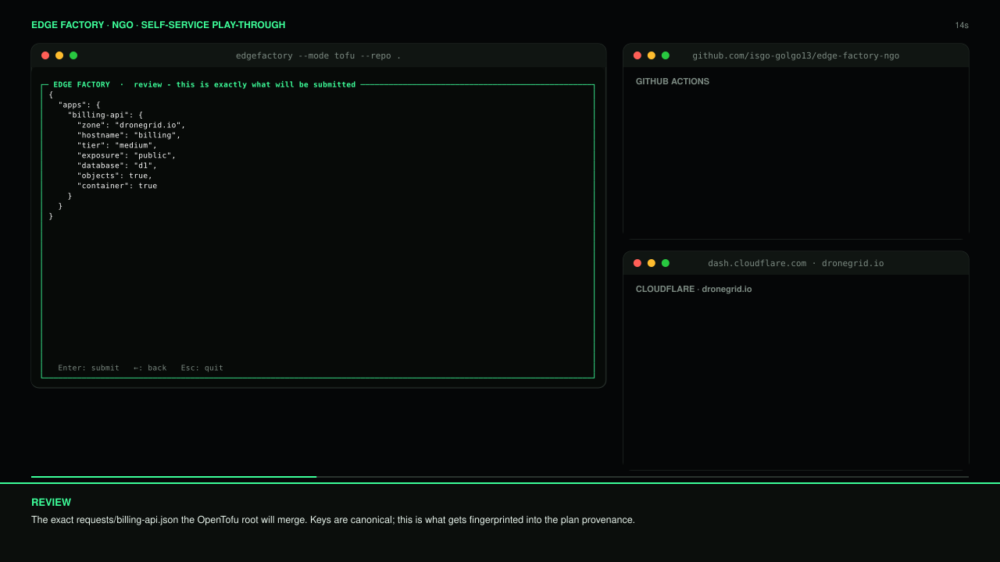
Stage 4
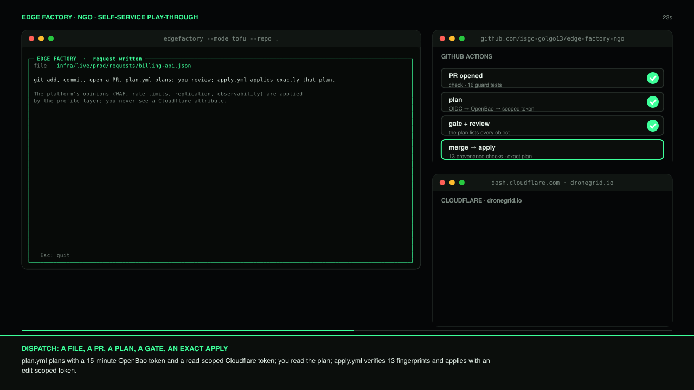
Stage 5
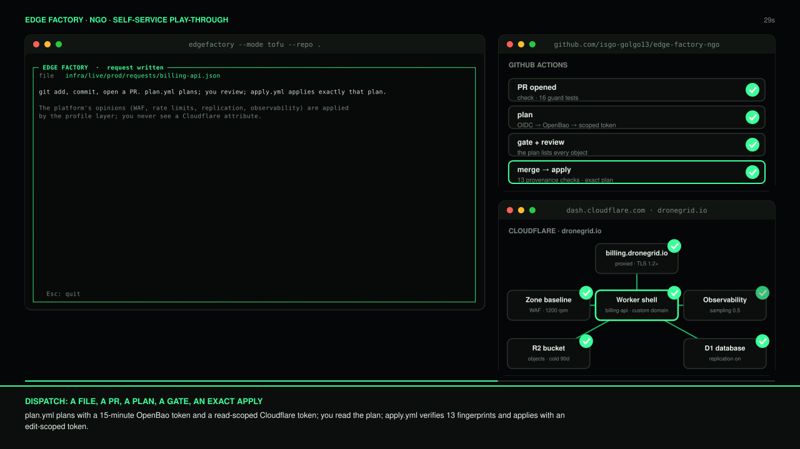
Stage 6
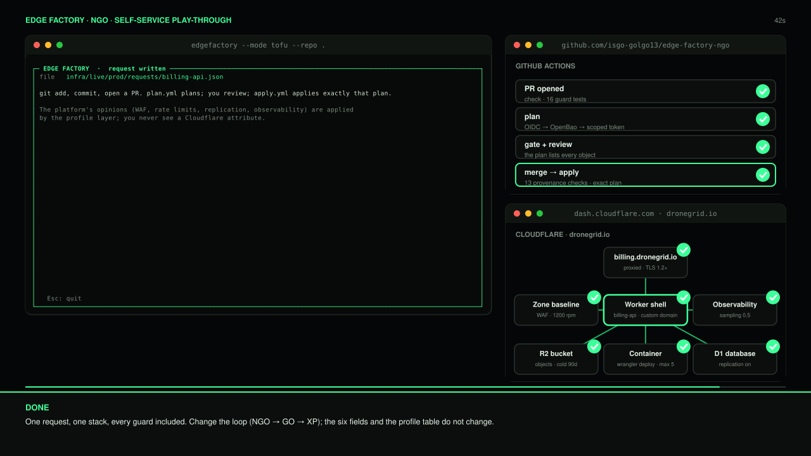


## TUI Self-Service for OpenTofu + Packer Design for Cloudflare Workflows (K8s GitOps - GO)

Stage 1
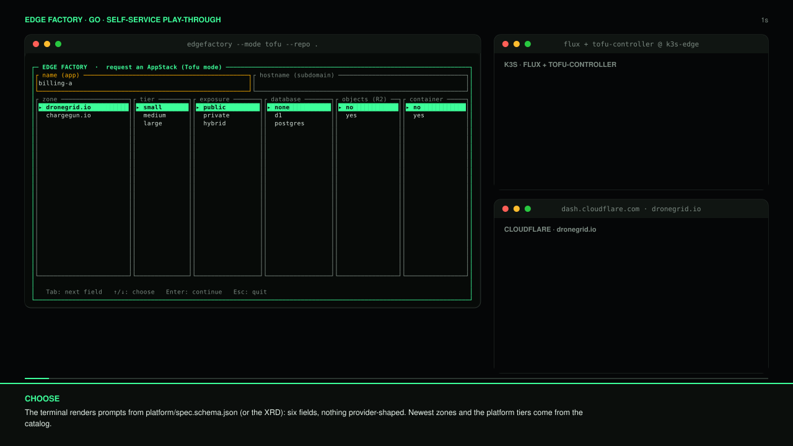
Stage 2
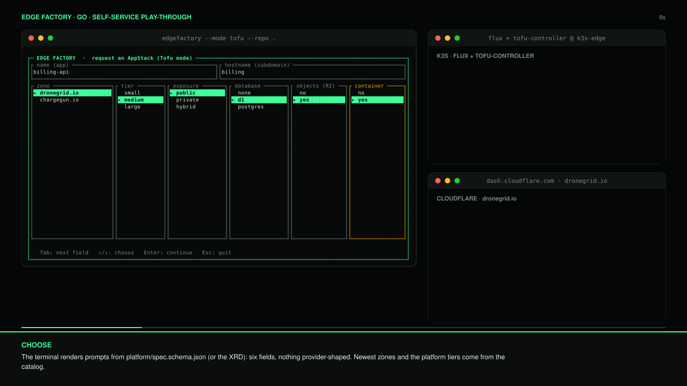
Stage 3

Stage 4
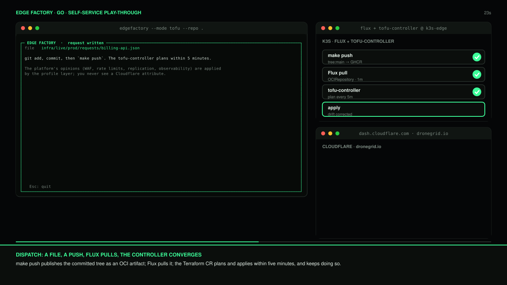
Stage 5
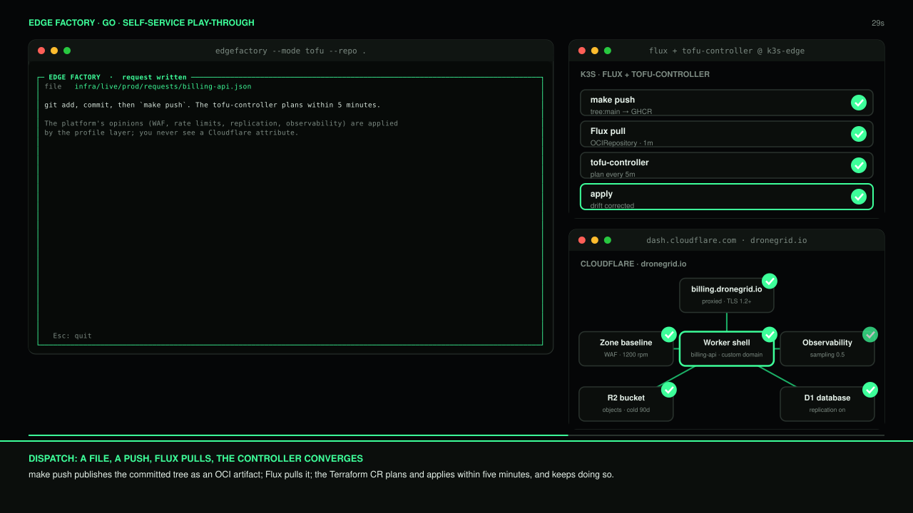
Stage 6
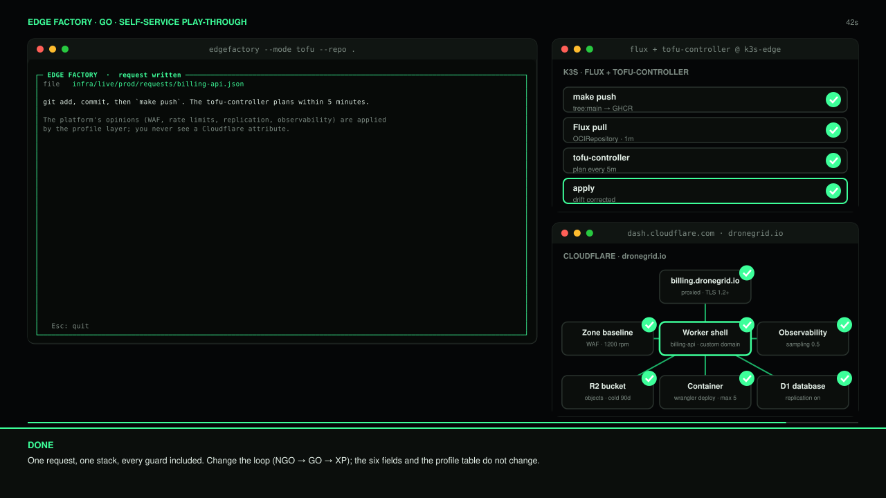


## TUI Self-Service for Crossplane + Packer Design for Cloudflare Workflows (K8s GitOps - GLGO)

Stage 1
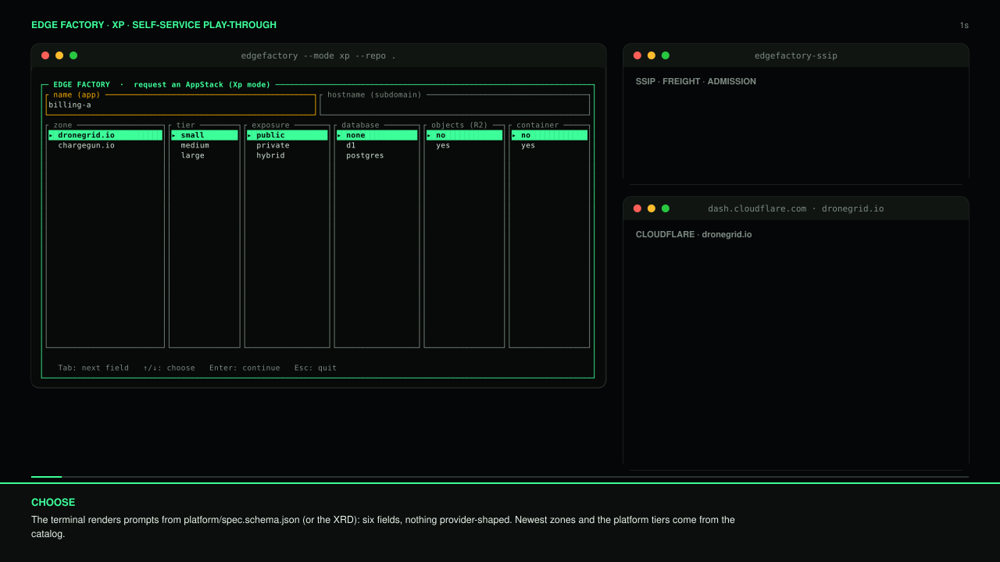
Stage 2
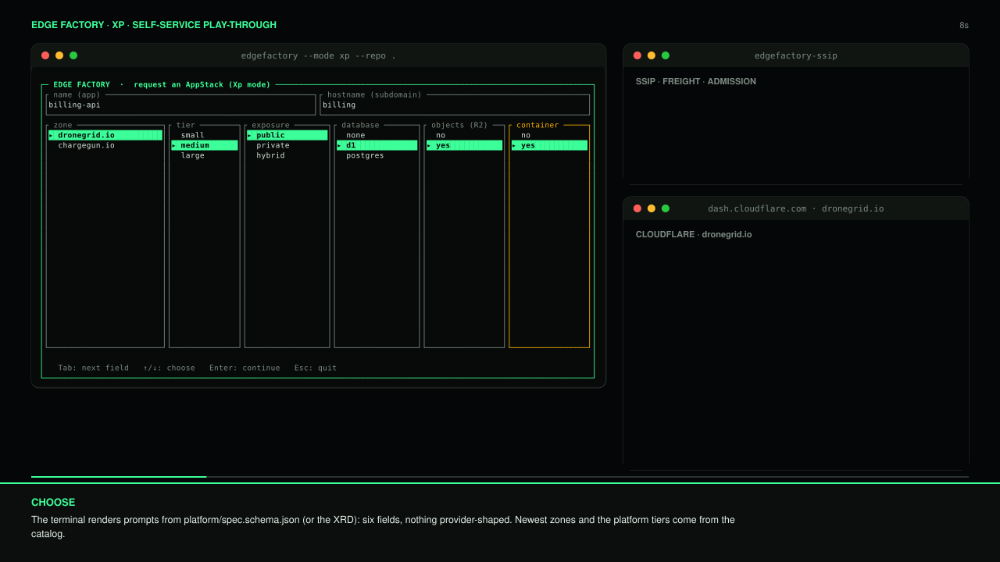
Stage 3
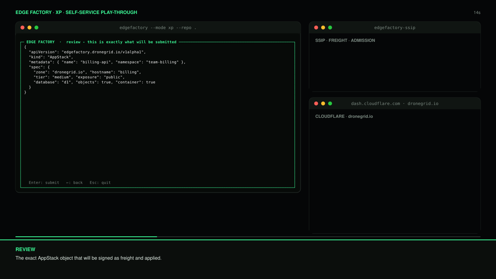
Stage 4
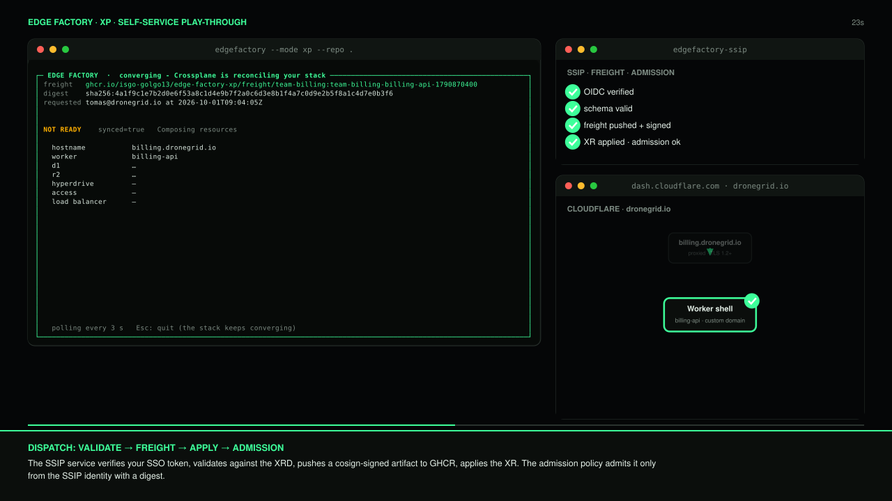
Stage 5
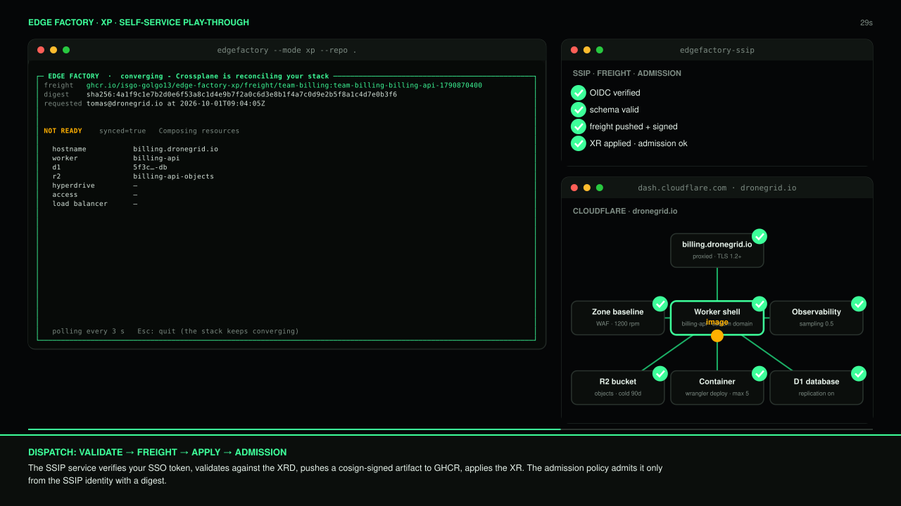
Stage 6
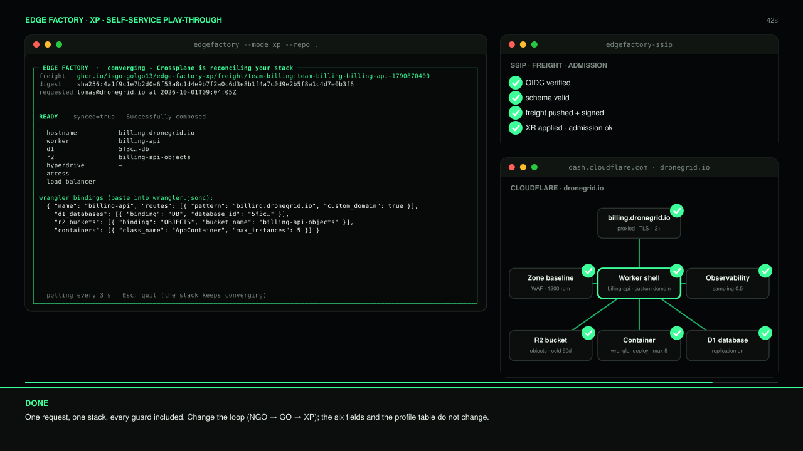


## References 

#### OpenTofu 
- https://opentofu.org/
- https://opentofu.org/docs/cli/code/
- https://search.opentofu.org/provider/opentofu/cloudflare/latest

#### OpenTofu Flux Controller
- https://github.com/flux-iac/tofu-controller
- https://flux-iac.github.io/tofu-controller/getting_started/
- https://flux-iac.github.io/tofu-controller/

#### Packer
- https://developer.hashicorp.com/packer
- https://developer.hashicorp.com/hcp/docs/packer

#### Crossplane
- https://www.crossplane.io/
- https://www.upbound.io/
- https://github.com/cdloh/provider-cloudflare

#### OpenTelemetry
- https://opentelemetry.io/

#### OpenBao (Vault)
- https://openbao.org/

#### OpenChoreo
- https://openchoreo.dev/

#### FluxCD
- https://fluxcd.io/

#### Rust
- https://rust-lang.org/
- https://ratatui.rs/
- https://leptos.dev/
- https://dioxuslabs.com/

#### Cloudflare
- https://www.cloudflare.com/
- https://www.cloudflare.com/products/d1/
- https://www.cloudflare.com/products/r2/
- https://www.cloudflare.com/products/containers/
- https://www.cloudflare.com/products/dns/
- https://www.cloudflare.com/products/cdn/
- https://www.cloudflare.com/products/workers/


